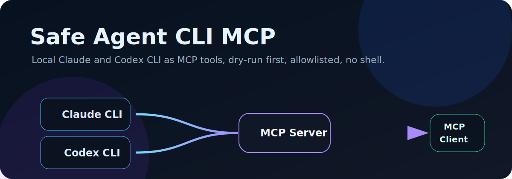
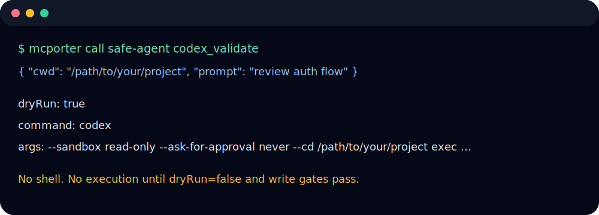
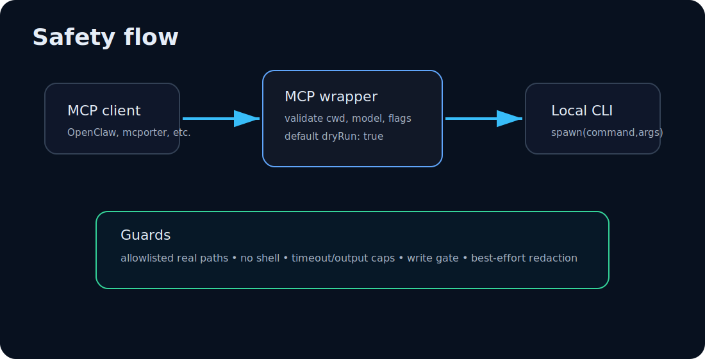

# Safe Agent CLI MCP

> Agent-in-agent workflows without YOLO by default.



[](LICENSE)
[](https://modelcontextprotocol.io/)
[](package.json)

Safe Agent CLI MCP wraps the local **Claude CLI** and **Codex CLI** as Model Context Protocol tools. It gives an MCP client a controlled way to ask a local coding agent for reviews, validations, and tasks without exposing a generic shell and without executing by default.

Use it when you want:

- A local MCP bridge for Claude and Codex CLI, not a remote agent service.
- Dry-run command previews before anything runs.
- Realpath checked project allowlists instead of broad filesystem access.
- Symmetric Claude and Codex tools that fit OpenClaw, mcporter, and other MCP clients.

This is for developers and agent operators who want nested agent workflows with boring safety defaults. Boring is doing work here.

> Independent project. Not affiliated with Anthropic, OpenAI, OpenClaw, or the Model Context Protocol project.

## What it does

Safe Agent CLI MCP packages two stdio MCP servers:

| Package | Binary | Wraps | Purpose |
|---|---|---|---|
| `@safe-agent-cli-mcp/claude-cli-mcp` | `claude-cli-mcp-server` | local `claude` CLI | Claude Code review and task workflows |
| `@safe-agent-cli-mcp/codex-cli-mcp` | `codex-cli-mcp-server` | local `codex` CLI | Codex CLI review and task workflows |

The core hook is simple: your primary agent can call a second local coding agent as a tool, but the wrapper returns a command preview first, checks the working directory against an allowlist, avoids shell strings, and requires an explicit write gate for task execution.



## Features

- **Dry-run by default:** review, task, and validate flows return the exact command and args before execution.
- **Realpath cwd allowlist:** `cwd` and `allowedRoots` are resolved with `realpath`, which blocks common symlink escapes.
- **No shell spawn:** CLIs run through `spawn(command, args)` with `shell: false`, not `sh -c`.
- **Command preview:** validation and dry-run responses show what would run, including cwd, args, timeout, sandbox, and policy flags.
- **Write gates:** `claude_task` and `codex_task` refuse real execution unless `dryRun: false` and `allowWrites: true` are both present.
- **Output redaction:** common bearer tokens, API keys, GitHub tokens, and optional email addresses are masked on a best-effort basis.
- **Claude and Codex parity:** matching status, config, validate, review, and task tools for both CLIs.
- **OpenClaw and plugin friendly:** includes `.mcp.json`, `.claude-plugin/plugin.json`, plugin metadata, and examples.
- **mcporter examples:** includes copyable `mcporter call` examples for validation and dry-run review flows.

## Architecture



```text
MCP client
  calls safe-claude or safe-codex over stdio
    validates input, cwd, model, timeout, sandbox, and write gates
      returns command preview by default
        optionally spawns local claude or codex without a shell
```

Read more in [`docs/architecture.md`](docs/architecture.md).

## Tool table

| Server | Tool | Execution behavior | Main use |
|---|---|---|---|
| Claude | `claude_status` | Runs `claude --version` only | Check local CLI availability |
| Claude | `claude_config` | No agent task execution | Inspect sanitized config and detected CLI path |
| Claude | `claude_validate` | Never runs Claude task | Validate inputs and return would-run argv |
| Claude | `claude_review` | Dry-run first, read-oriented guard text | Ask Claude to review without edits by default |
| Claude | `claude_task` | Dry-run first, write gate required for real execution | Ask Claude to perform a local task |
| Codex | `codex_status` | Runs `codex --version` only | Check local CLI availability |
| Codex | `codex_config` | No agent task execution | Inspect sanitized config and detected CLI path |
| Codex | `codex_validate` | Never runs Codex task | Validate inputs and return would-run argv |
| Codex | `codex_review` | Dry-run first, read-only sandbox only | Ask Codex to review without writes by default |
| Codex | `codex_task` | Dry-run first, write gate required for real execution | Ask Codex to perform a local task |

## Quickstart

Prerequisites:

- Node.js 20 or newer.
- The local Claude CLI and/or Codex CLI installed and authenticated if you plan to execute real runs.
- An MCP client that can launch stdio servers.

```bash
git clone https://github.com/<owner>/safe-agent-cli-mcp.git
cd safe-agent-cli-mcp
npm install
npm run typecheck
npm run build
npm test
```

Create ignored local config files from the examples:

```bash
cp packages/claude-cli-mcp/claude-mcp.config.example.json packages/claude-cli-mcp/claude-mcp.config.json
cp packages/codex-cli-mcp/codex-mcp.config.example.json packages/codex-cli-mcp/codex-mcp.config.json
```

Set narrow project roots before real use:

```json
{
  "allowedRoots": ["/path/to/project"]
}
```

Then point your MCP client at one or both built stdio servers. The install path is the absolute path to this cloned repository on the machine that launches the MCP server:

```json
{
  "mcpServers": {
    "safe-claude": {
      "command": "node",
      "args": ["/path/to/safe-agent-cli-mcp/packages/claude-cli-mcp/dist/index.js"]
    },
    "safe-codex": {
      "command": "node",
      "args": ["/path/to/safe-agent-cli-mcp/packages/codex-cli-mcp/dist/index.js"]
    }
  }
}
```

More client snippets are in [`examples/`](examples/).

## Examples

### Dry-run a review

```json
{
  "cwd": "/path/to/project",
  "prompt": "Review the authentication flow for obvious bugs.",
  "dryRun": true
}
```

Call either:

- `claude_review`
- `codex_review`

The response contains the resolved command, argv, cwd, timeout, output cap, model or sandbox settings, and allowlist. It does not run the downstream CLI while `dryRun` is true.

### Validate before execution

```json
{
  "cwd": "/path/to/project",
  "prompt": "Check whether this task would be allowed.",
  "dryRun": true,
  "timeoutSeconds": 120
}
```

Call either:

- `claude_validate`
- `codex_validate`

Validation is useful in automated flows because it checks shape and policy without starting a nested agent.

### Explicitly allow a task run

```json
{
  "cwd": "/path/to/project",
  "prompt": "Update tests for the new parser behavior.",
  "dryRun": false,
  "allowWrites": true
}
```

Both fields are required for task execution. If either is missing, `claude_task` and `codex_task` refuse the run.

### mcporter examples

```bash
mcporter tools safe-codex
mcporter tools safe-claude

mcporter call safe-codex codex_validate '{"cwd":"/path/to/project","prompt":"Review this code","dryRun":true}'
mcporter call safe-claude claude_validate '{"cwd":"/path/to/project","prompt":"Review this code","dryRun":true}'
```

See [`examples/mcporter/call-examples.md`](examples/mcporter/call-examples.md).

## OpenClaw plugin usage, optional

This repository includes an OpenClaw-compatible packaging layer:

- `.claude-plugin/plugin.json` lets OpenClaw detect the repository as a Claude-compatible bundle.
- `.mcp.json` registers `safe-claude` and `safe-codex` using `${CLAUDE_PLUGIN_ROOT}` placeholders.
- `plugin/openclaw.plugin.json` is metadata for future native plugin flows.

Build and validate first:

```bash
npm install
npm run build
npm run validate:plugin
```

Optional local registration, run only after you have reviewed the command and chosen to install the plugin:

```bash
openclaw plugins install --link .
openclaw plugins enable safe-agent-cli-mcp
openclaw plugins inspect safe-agent-cli-mcp --json
```

Do not hand-edit live OpenClaw config. Use OpenClaw CLI commands for registration and removal. Plugin notes live in [`plugin/README.md`](plugin/README.md), with OpenClaw examples in [`examples/openclaw/`](examples/openclaw/).

## Security model summary

Safe Agent CLI MCP reduces the blast radius compared with a generic shell tool, but it is not a formal sandbox or DLP system.

| Control | What it does | Caveat |
|---|---|---|
| Dry-run default | Returns command previews without executing the downstream CLI | A caller can still request real execution |
| Realpath cwd allowlist | Requires `cwd` to resolve under configured roots | It controls the process start directory, not every file a downstream CLI may read |
| No shell | Uses `spawn(command, args)` with `shell: false` | The downstream CLI has its own behavior and tool policy |
| Write gate | Task tools require `dryRun: false` plus `allowWrites: true` | Review tools are guarded by wrapper policy, not OS-level confinement |
| Codex sandbox flags | Defaults reviews to `read-only` and tasks to `workspace-write` | Codex `read-only` is a write safety control, not proof of complete read confinement |
| Claude permission mode | Defaults to Claude CLI permission behavior and blocks Bash/Edit/Write for review | Claude permission semantics are delegated to the installed Claude CLI |
| Redaction | Masks common token patterns and optionally emails | Best effort only, do not send secrets in prompts |

See [`SECURITY.md`](SECURITY.md) and [`docs/security-model.md`](docs/security-model.md) before using real execution in sensitive repositories.

## Limitations

- This is not a formal sandbox, container, VM, policy engine, or secrets boundary.
- Codex `read-only` should be treated as a write-prevention control, not guaranteed read confinement.
- Claude permission behavior depends on the installed Claude CLI and your local configuration. `bypassPermissions` is not the default here.
- Redaction is best effort and pattern-based.
- Downstream CLI behavior can change across versions. Pin and test CLI versions where reproducibility matters.
- The project is independent and has no affiliation with Anthropic, OpenAI, OpenClaw, or the Model Context Protocol project.

## Comparison

| Capability | Generic shell MCP | One-off prompt script | Safe Agent CLI MCP |
|---|---:|---:|---:|
| Exposes arbitrary shell commands | Yes | Usually no | No |
| Dry-run first by default | Rarely | Sometimes | Yes |
| Shows exact command preview | Sometimes | Sometimes | Yes |
| Realpath cwd allowlist | Rarely | Sometimes | Yes |
| Claude and Codex specific flags | No | Limited | Yes |
| Write-capable tool gate | Rarely | Custom | Yes |
| Output redaction | Rarely | Custom | Yes |
| OpenClaw bundle metadata | No | No | Yes |
| Best fit | Maximum flexibility | A narrow local workflow | Controlled nested agent calls |

See [`docs/comparison.md`](docs/comparison.md) for the longer version.

## ClawHub and GitHub publishing

GitHub repository: <https://github.com/udaymanish6/openclaw-safe-agent-cli-mcp>

The repository is structured for GitHub and ClawHub presentation, including assets, examples, docs, package metadata, and OpenClaw plugin files. Confirm final registry names, URLs, and publishing permissions before adding npm or ClawHub badges. This README intentionally avoids fake published-status badges.

## FAQ

### Does this install Claude or Codex?

No. It wraps local CLIs. Install and authenticate Claude CLI and/or Codex CLI separately.

### Does dry-run mean nothing can go wrong?

Dry-run means this wrapper does not start the downstream task. Your MCP client still receives command previews and metadata, and real execution is available if explicitly requested.

### Why is `allowedRoots` empty by default?

A public default should not grant access to a home directory or workspace. Add only the project roots you want the wrapper to use.

### Can I use only Claude or only Codex?

Yes. Register only the server you need.

### Is this safe to expose on the internet?

No. These servers are designed for local stdio MCP use. Do not expose them as public network services.

### Can review tools write files?

The wrapper configures review tools to be read-oriented and dry-run by default. Codex review is constrained to `read-only`; Claude review adds guard text and disallows Bash/Edit/Write tools. This is still wrapper policy around downstream CLIs, not a formal sandbox.

### Why not just give the agent a shell?

Because a shell is a command execution primitive. This project exposes a smaller interface with validation, previews, allowlisted cwd, and tool-specific safety gates.

## Development

```bash
npm install
npm run typecheck
npm run build
npm test
npm run validate:plugin
```

Useful files:

- [`packages/shared/src/index.ts`](packages/shared/src/index.ts): cwd validation, redaction, command execution, and response helpers.
- [`packages/claude-cli-mcp/src/index.ts`](packages/claude-cli-mcp/src/index.ts): Claude tool definitions and validation.
- [`packages/codex-cli-mcp/src/index.ts`](packages/codex-cli-mcp/src/index.ts): Codex tool definitions and validation.
- [`tests/`](tests/): dry-run, allowlist, model, write gate, and redaction tests.
- [`CONTRIBUTING.md`](CONTRIBUTING.md): contribution notes.

Contributions should keep the central promise intact: no generic shell, dry-run first, explicit write gates, and narrow local configuration.

## License

MIT. See [`LICENSE`](LICENSE).
